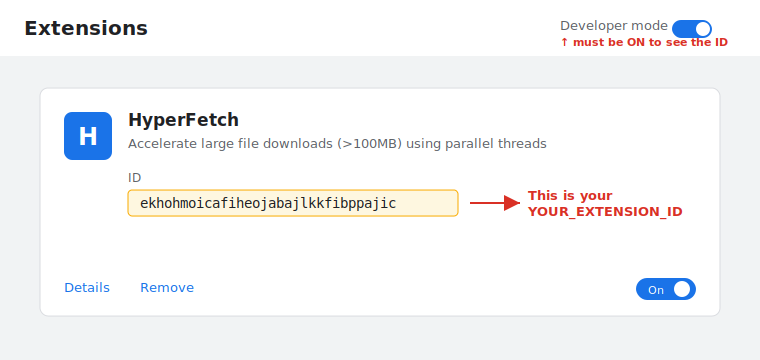

<h1 align="center">HyperFetch&nbsp;</h1>

<p align="center">
  <strong>Accelerate large HTTP/HTTPS downloads using multiple parallel threads (byte-range requests).</strong>
</p>

<p align="center">
  
  
  
  
  
</p>

---

You can use HyperFetch two ways:

1. 🧩 [Use the browser extension](#1-use-the-browser-extension) — one-click acceleration from [Chrome](#chrome-extension) or [Firefox](#firefox-extension).
2. 💻 [Use the `downloader` utility from the command line](#2-use-the-downloader-utility-command-line) — scriptable, headless.

Large downloads (over 100 MB by default) are split across several parallel connections, so
they finish much faster. If a server doesn't support this, HyperFetch quietly uses a normal
single-stream download instead.

## 📋 Requirements

- 🐍 Python 3.7+
- 🖥️ Linux, macOS, or Windows
- 🌐 For the extension: Chrome 88+ or Firefox 121+

## ⚡ Quick start

## 🧩 1. Use the browser extension

> ⚠️ **Important:** Keep this project folder in a permanent location after running
> `install.sh` / `install.bat`. The native-host registration stores absolute paths to
> files inside this directory. If you move or delete it later, **Test Native Host**
> and accelerated downloads will fail until you reinstall from the new location.

###  Chrome extension


The Chrome extension detects large downloads, then downloads them faster using parallel
connections.

#### 📥 Install

1. Register the helper (once):

   **Linux / macOS:**

   ```bash
   ./install.sh            # Sets up both Chrome and Firefox
   ./install.sh chrome     # Chrome only
   ```

   **Windows** (`install.bat`, or run in a terminal):

   ```bat
   install.bat            :: Sets up both Chrome and Firefox
   install.bat chrome     :: Chrome only
   ```

2. Open `chrome://extensions/`.
3. Turn on **Developer mode** (top-right).
4. Click **Load unpacked** and select the `chrome-extension` folder.
5. Confirm the **ID** on the HyperFetch card is `ekhohmoicafiheojabajlkkfibppajic`.

> **Windows:** fully quit Chrome (close every window) and reopen it after registering the
> helper — Chrome only reads the native-host registry entry at startup.



#### 🚀 Usage

1. Click the HyperFetch icon → **Settings** tab and adjust anything you like:

   | Setting            | Default         | Description                              |
   | ------------------ | --------------- | ---------------------------------------- |
   | Thread Count       | 8               | Parallel download connections (1–32)     |
   | Min File Size      | 100 MB          | Files below this download normally       |
   | Download Directory | Browser default | Where to save files                      |

2. Click **Test Native Host** to confirm it's connected.
3. Start any large download — HyperFetch offers to speed it up and shows live progress.

> Having trouble? See [Troubleshooting](#-troubleshooting).

---

###  Firefox extension

The Firefox extension works just like the Chrome one — it detects large downloads and speeds
them up with parallel connections.

#### 📥 Install

1. Register the helper (once):

   **Linux / macOS:**

   ```bash
   ./install.sh            # Sets up both Chrome and Firefox
   ./install.sh firefox    # Firefox only
   ```

   **Windows** (`install.bat`, or run in a terminal):

   ```bat
   install.bat            :: Sets up both Chrome and Firefox
   install.bat firefox    :: Firefox only
   ```

2. Open `about:addons`.
3. Click the gear icon → **Install Add-on From File…**.
4. Select `firefox-extension/hyperfetch.xpi`.

   > Don't have `hyperfetch.xpi`? It's a one-time build step — see
   > [firefox-extension/README.md](firefox-extension/README.md).
   > (For a quick trial you can instead load it temporarily from
   > `about:debugging#/runtime/this-firefox`, but it's removed when Firefox restarts.)

#### 🚀 Usage

1. Click the HyperFetch icon → **Settings** tab and adjust the thread count, minimum file
   size, and download directory.
2. Click **Test Native Host** to confirm it's connected.
3. Start any large download — HyperFetch offers to speed it up and shows live progress.

> Having trouble? See [Troubleshooting](#-troubleshooting).

---

## 💻 2. Use the `downloader` utility (command line)

The `downloader` binary is the standalone, scriptable engine. It takes a URL and writes the
file, using multiple threads when the server supports ranges.

### ▶️ Basic usage

Run with defaults (`8` threads), saving to the current directory:

```bash
./downloader "https://hepdsw-web.bose.com/ec/prod/Eddie/Nightly/master/latest/product_update.zip" -o .
```

Choose your own output file name:

```bash
./downloader "https://hepdsw-web.bose.com/ec/prod/Eddie/Nightly/master/latest/product_update.zip" -o product_update.zip
```

Try a different thread count:

```bash
./downloader "https://hepdsw-web.bose.com/ec/prod/Eddie/Nightly/master/latest/product_update.zip" -o product_update.zip -t 12
```

### ⚙️ All options

```text
usage: downloader [-h] [-o OUTPUT] [-t THREADS] [-c CHUNK_SIZE]
                  [--timeout TIMEOUT] [--retries RETRIES] [--token TOKEN]
                  [--token-env TOKEN_ENV] [--token-type {api_key,bearer}]
                  [--skip-url-normalize] [--cookies COOKIES]
                  [--referer REFERER] [--user-agent USER_AGENT] [--json]
                  url
```

**⭐ Most-used options** (these cover almost every download):

| Option                          | Default                  | Description                                             |
| ------------------------------- | ------------------------ | ------------------------------------------------------- |
| **`url`** (positional)          | –                        | HTTP/HTTPS URL to download                              |
| **`-o, --output`**              | current directory        | Output file path or existing directory                  |
| **`-t, --threads`**             | `8`                      | Parallel threads for range download                     |
| **`--token`**                   | –                        | Access token for authenticated downloads                |
| **`--token-type {api_key,bearer}`** | `api_key`            | Send token as `X-JFrog-Art-Api` (api_key) or `Authorization: Bearer` |

**Other options** (rarely needed — defaults are fine):

| Option                          | Default                  | Description                                             |
| ------------------------------- | ------------------------ | ------------------------------------------------------- |
| `-c, --chunk-size`              | `1048576`                | Read chunk size in bytes per thread                     |
| `--timeout`                     | `30`                     | Socket timeout in seconds                               |
| `--retries`                     | `3`                      | Retry attempts per thread/range                         |
| `--token-env`                   | `BOSE_ARTIFACTORY_TOKEN` | Env var to read token from if `--token` is not provided |
| `--skip-url-normalize`          | off                      | Skip automatic URL normalization                        |
| `--cookies`                     | –                        | Cookies to send (`key=value; key=value`)                |
| `--referer`                     | –                        | Referer header                                          |
| `--user-agent`                  | a Chrome UA              | User-Agent header                                       |
| `--json`                        | off                      | Emit progress as JSON lines (for integration)           |

### 🎛️ Practical tuning

- Start with `-t 8`.
- If throughput is low, try `-t 12` or `-t 16`.
- If speed becomes unstable or slower, reduce to `-t 4`.

### 📝 Notes

- Falls back to single-thread mode if range download is not supported.
- Retries each range automatically (`--retries`, default `3`).
- Splits downloads into smaller byte ranges so worker threads stay busy deeper into the download.
- Shows live current speed and final average speed separately.
- Automatically converts Artifactory UI browse URLs (`/ui/repos/tree/General/...`) to direct `/artifactory/...` download URLs.

### 🔐 Authenticated URLs (Artifactory)

You can download protected URLs using token-based auth.

- Default token type is `api_key` (sends the `X-JFrog-Art-Api` header).
- Default token env var is `BOSE_ARTIFACTORY_TOKEN`.

If a URL requires authentication, the downloader auto-detects it and retries with the token
from `BOSE_ARTIFACTORY_TOKEN`. If that env var is missing or empty, it prints an error with
export steps.

#### 🔑 Option 1: pass the token directly

```bash
./downloader "https://artifactory.bose.com/ui/repos/tree/General/OLA-Products/Eddie/snapshot/master/26.0.1-2742%2Bbc2f606/update-ota-eddie-dev_26.0.1-2742%2Bbc2f606.zip" \
	-o update-ota-eddie-dev_26.0.1-2742+bc2f606.zip \
	--token "YOUR_TOKEN" \
	-t 8
```

#### ⭐ Option 2 (recommended): token from an environment variable

```bash
export BOSE_ARTIFACTORY_TOKEN="YOUR_TOKEN"
./downloader "https://artifactory.bose.com/ui/repos/tree/General/OLA-Products/Eddie/snapshot/master/26.0.1-2742%2Bbc2f606/update-ota-eddie-dev_26.0.1-2742%2Bbc2f606.zip" \
	-o update-ota-eddie-dev_26.0.1-2742+bc2f606.zip \
	-t 8
```

#### 🎫 Bearer tokens

For endpoints that expect `Authorization: Bearer <token>`, use `--token-type bearer`:

```bash
export BOSE_ARTIFACTORY_TOKEN="YOUR_TOKEN"
./downloader "https://artifactory.bose.com/artifactory/OLA-Products/Eddie/snapshot/master/26.0.1-2742+bc2f606/update-ota-eddie-dev_26.0.1-2742+bc2f606.zip" \
	-o update-ota-eddie-dev_26.0.1-2742+bc2f606.zip \
	--token-env BOSE_ARTIFACTORY_TOKEN \
	--token-type bearer \
	-t 8
```

### 📦 JSON progress (scripting)

Use `--json` to emit machine-readable progress lines, which is how the native host consumes
the downloader:

```bash
./downloader "https://example.com/file.zip" -o file.zip --json
```

---

## 🪟 Windows notes

On Windows the setup works differently from Linux/macOS, so use `install.bat`
(not `install.sh`):

- **Why a separate script?** Windows browsers don't read native-host manifests from a
  folder — they look them up in the **Windows Registry**, and they can't launch a `.py`
  file directly. `install.bat` handles all of this for you.
- **What it does:** finds your Python, writes a small `native-host\run_native_host.bat`
  wrapper, writes the manifest JSON, and registers it under
  `HKEY_CURRENT_USER` for Chrome and Firefox.
- **No admin required** — everything is written to your own user account.
- **`install.bat` vs `setup-windows.ps1`:** the `.bat` is just a launcher that runs
  the `.ps1`, which does the real work. **Keep both files** — deleting the `.ps1` would
  break the `.bat`. You can equivalently run:

  ```powershell
  powershell -ExecutionPolicy Bypass -File .\setup-windows.ps1
  ```
- **Requirement:** Python 3 must be installed and on your `PATH` (install from
  [python.org](https://www.python.org/downloads/) and check *“Add Python to PATH”*).
  Verify with `python --version` in a new terminal.
- **After running it,** fully quit and reopen the browser before clicking
  **Test Native Host** — the registry entry is only read at startup.

---

## 🛠️ Troubleshooting

**Download didn't speed up?**
Some servers don't support parallel downloads, so HyperFetch falls back to a normal download.
That's expected and the file still downloads correctly.

**Chrome — "Native host not connecting" / Test Native Host fails?**

- Re-run `./install.sh chrome`.
- Make sure the extension **ID** is `ekhohmoicafiheojabajlkkfibppajic`.
- Reload the extension from `chrome://extensions/`.

**Windows — "Native host not connecting" / Test Native Host fails?**

- Re-run `install.bat chrome` (or `firefox`).
- **Fully quit the browser** (close every window — check the tray) and reopen it; the
  registry entry is only read at startup.
- Make sure Python is installed and on `PATH`: run `python --version` in a new terminal.
  If it's missing, install it (check *“Add Python to PATH”*) and re-run the script.

**Windows — `[WinError 193] %1 is not a valid Win32 application`?**

- This means the helper connected but couldn't launch Python. Update to the latest files
  and re-run `install.bat`. Ensure Python 3 is installed and on `PATH`.

**Firefox — "Native host disconnected"?**

- This almost always means you're using the **Snap or Flatpak** Firefox (the default on
  Ubuntu), which can't launch helper apps. Install the regular Firefox from the
  [Mozilla APT repo](https://support.mozilla.org/kb/install-firefox-linux#w_install-firefox-deb-package-for-debian-based-distributions)
  or the official tarball, then re-run `./install.sh firefox`.
- Otherwise, re-run `./install.sh firefox` and reinstall the add-on.

**Still stuck?**
See the per-component notes in
[chrome-extension/README.md](chrome-extension/README.md),
[firefox-extension/README.md](firefox-extension/README.md), and
[native-host/README.md](native-host/README.md).
